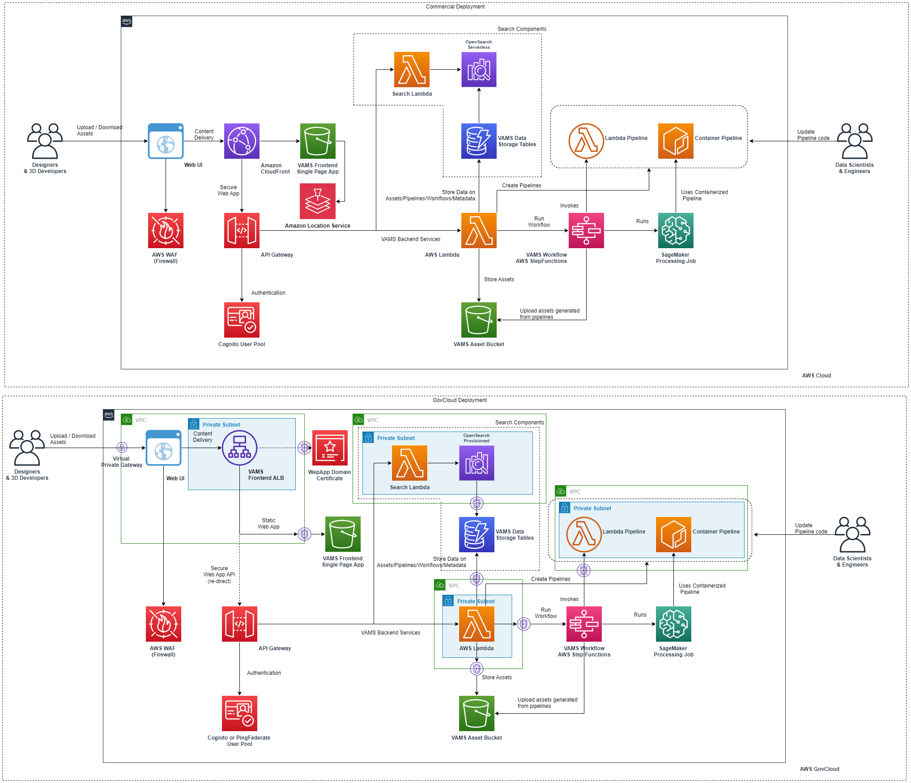

# Visual Asset Management System(VAMS)

## Introduction

_Visual Asset Management System (VAMS)_ is a purpose-built, AWS native solution for the management and distribution of specialized visual assets used in spatial computing. VAMS offers a simplified solution for organizations to ingest, store, and manage visual assets in the cloud, which empowers any user with a web browser to upload, manage, visualize, transform, and retrieve visual assets. Existing workflows that leverage both custom code and pre-built or third-party applications can also be migrated to VAMS and ran in the AWS cloud, as opposed to being limited by the on-premise capacity available. VAMS is customizable and expandable with option of being further tailored to specific use-cases by development teams.

_Customer Value:_ VAMS addresses challenges faced by customers embarking on Spatial Computing initiatives, such as Augmented and Virtual Reality (AR/VR). Organizations that previously had to manage these assets on local systems can now do so from a web-based application.

Leveraging Amazon Simple Storage Service (Amazon S3) as a low-cost, high availability storage layer, VAMS provides a purpose-built API for 3D asset management. This API provides a layer of abstraction, allowing custom integrations to be built. Custom integrations allow workloads and applications to be moved to the cloud, unlocking access to the entire breadth and depth of the AWS ecosystem.

_Use Cases:_
Sample use cases that have leveraged early iterations of VAMS include:

-   Distribution and management of 3D Assets using highly available S3 storage
-   Modifications of 3D assets using VAMS Pipelines
-   Creating workflows for 3D asset modification using VAMS Workflows

## Screenshots

## Architecture Overview

## 3D Asset Types Supported for In-Browser Viewing

VAMS currently integrates with several different asset viewers and supports the following formats for viewing assets interactively.

| Name                              | Extension | Type   | Viewer           |
| :-------------------------------- | :-------- | :----- | :--------------- |
| Wavefront                         | obj       | text   | Online 3D Viewer |
| 3D Studio                         | 3ds       | binary | Online 3D Viewer |
| Stereolithography                 | stl       | text   | Online 3D Viewer |
| Stereolithography                 | stl       | binary | Online 3D Viewer |
| Polygon File Format               | ply       | text   | Online 3D Viewer |
| Polygon File Format               | ply       | binary | Online 3D Viewer |
| glTF                              | gltf      | text   | Online 3D Viewer |
| glTF                              | glb       | binary | Online 3D Viewer |
| Object File Format                | off       | text   | Online 3D Viewer |
| Object File Format                | off       | binary | Online 3D Viewer |
| Dotbim                            | bim       | text   | Online 3D Viewer |
| Rhinoceros 3D                     | 3dm       | binary | Online 3D Viewer |
| Filmbox                           | fbx       | text   | Online 3D Viewer |
| Filmbox                           | fbx       | binary | Online 3D Viewer |
| Collada                           | dae       | text   | Online 3D Viewer |
| Virtual Reality Modeling Language | wrl       | text   | Online 3D Viewer |
| 3D Manufacturing Format           | 3mf       | text   | Online 3D Viewer |
| Industry Foundation Classes       | ifc       | text   | Online 3D Viewer |
| Point Cloud - LiDAR Data Exchange | laz       | binary | Potree Viewer    |
| Point Cloud - LiDAR Data Exchange | las       | binary | Potree Viewer    |
| Point Cloud - LiDAR Data Exchange | e57       | binary | Potree Viewer    |

Viewers available include:

-   [Online 3D Viewer](https://github.com/kovacsv/Online3DViewer)
-   [Potree Viewer](https://github.com/potree/potree)

Please take note:

-   While we are limited to these formats to view assets, any file format may be uploaded to VAMS.
-   There are some limitations with formats that leverage multiple files such as glTF that uses json with references to other files.
-   Some viewers like Potree Viewer requires additional pipelines to be deployed to fully generate and view point cloud files.

## Install

### Requirements

-   Python 3.10
-   Poetry (for managing python dependencies in the VAMS backend)
-   Docker
-   Node >=18.7
-   Yarn >=1.22.19
-   Node Version Manager (nvm)
-   AWS cli
-   AWS CDK cli
-   Programatic access to AWS account at minimum access levels outlined above.

### Deploy VAMS for the First Time

#### Build & Deploy Steps (Linux/Mac)

VAMS Codebase is changing frequently and we recommend you checkout the stable released version from github.

You can identify stable releases by their tag. Fetch the tags `git fetch --all --tags` and then `git checkout tags/TAG` or `git checkout -b TAG tags/TAG` where TAG is the actual desired tag. A list of tags is found by running `git tag --list` or on the [releases page](https://github.com/awslabs/visual-asset-management-system/releases).

1. `cd ./web && nvm use` - make sure you're node version matches the project. Make sure Docker daemon is running.

2. `yarn install` - make sure you install the packages required by the web app (Take note, `npm install` does not result in a working build of the application - please use yarn).

3. `npm run build` - build the web app.

4. `cd ../infra && npm install` - installs dependencies defined in package.json.

5. If you haven't already bootstrapped your aws account with CDK. `cdk bootstrap aws://101010101010/us-east-1` - replace with your account and region. If you are boostrapping a GovCloud account, run `export AWS_REGION=[gov-cloud-region]` as the AWS SDK needs to be informed to use GovCloud endpoints.

6. Modify the `config.json` in `/infra/config` to set the VAMS deployment parameters and features you would like to deploy. Recommended minimum fields to update are `region`, `adminEmailAddress`, and `baseStackName` when using the default provided template. More information about the configuration options can be found in the Configuration Options section below.

7. (Optional) Override the the CDK stack name and region for deployment with environment variables `export AWS_REGION=us-east-1 && export STACK_NAME=dev` - replace with the region you would like to deploy to and the name you want to associate with the cloudformation stack that the CDK will deploy.

8. (FIPS Use Only) If deploying with FIPS, enable FIPS environment variables for AWS CLI `export AWS_USE_FIPS_ENDPOINT=true` and enable `app.useFips` in the `config.json` configuration file in `/infra/config`

9. (External VPC Import Only) If importing an external VPC with subnets in the `config.json` configuration, run `cdk deploy --all --require-approval never --context loadContextIgnoreVPCStacks=true` to import the VPC ID/Subnets context and deploy all non-VPC dependant stacks first. Failing to run this with the context setting or configuration setting of `loadContextIgnoreVPCStacks` will cause the final deployment of all stacks step to fail.

10. `npm run deploy.dev` - An account is created in an AWS Cognito User Pool using the email address specified in the infrastructure config file. Expect an email from no-reply@verificationemail.com with a temporary password.

    10a. Ensure that docker is running before deploying as a container will need to be built

#### Deployment Success

1.a (Default)(Cloudfront Deployment) Navigate to URL provided in `{stackName].WebAppCloudFrontDistributionDomainName{uuid}` from `cdk deploy` output.

1.b (ALB Deployment Feature) Navigate to URL provided in `webDistributionUrl` from `cdk deploy` output.

2. Check email for temporary account password to log in with the email address you provided.

### Multiple Deployments With Different or Same Region in Single Account

You can change the region and deploy a new instance of VAMS by changing the `config.json` or setting the environment variables to new values (`export AWS_REGION=us-east-1 && export STACK_NAME=dev`) and then running `npm run deploy.dev` again.

### Deploy VAMS Updates

To deploy customzations or updates to VAMS, you can update the stack by running `cdk deploy --all --require-approval never`. A changeset is created and deployed to your stack.

Please note, depending on what changes are in flight, VAMS may not be available to users in part or in whole during the deployment. Please read the change log carefully and test changes before exposing your users to new versions.

### Already have Assets in S3 that you want to register in VAMS?

VAMS can be deployed with a `stagingBucketName` config parameter to enable copying from an existing asset bucket.

To deploy with staging bucket, just set the `stagingBucketName` config parameter to your cdk deployment and VAMS will register your existing bucket as a staging bucket.

Once the deployment is complete, you can invoke the `/assets/uploadAssetWorkflow` API to start copying the assets into the VAMS S3 bucket.

Please refer to the uploadAssetWorkflow in the [API docs](./VAMS_API.yaml) to find out about the API request body.

### Configuration Options

VAMS backend allows for basic to advanced configuration based on the environment and use-case need.

Configuration files can be found in `/infra/config` with `config.json` being the primary file used during deployment. Additional config template files exist for common environment setups for Commercial or GovCloud deployments.

Recommended minimum fields to update are `region`, `adminEmailAddress`, and `baseStackName` when using the default provided templates.

Some configuration options can be overriden at time of deployment with either environment variables or cdk context parameters (--context X) used with `cdk deploy`

-   `name` | default: vams | #Base application name to use in the full CDK stack name

-   `env.account` | default: NULL | #AWS Account to use for CDK deployment. If null, pulled from CDK environment.
-   `env.region` | default: us-east-1 | #AWS Region to use for CDK deployment. If null, pulled from CDK environment.
-   `env.loadContextIgnoreVPCStacks` | default: false | #Mode to ignore synth and deployments of any nested stack that needs a VPC in order to first load context through a first synth run.

-   `app.baseStackName` | default: prod | #Base stack stage environment name to use when creating full CDK stack name.
-   `app.stagingBucketName` | default: NULL | #Staging bucket for transfering assets between deployment. If null, no staging bucket will be created.
-   `app.adminEmailAddress` | default: adminEmail@example.com | #Administrator email address to use for the initial super admin account.

-   `app.useWaf` | default: true | #Feature to turn use of Amazon Web Application Firewall on/off for VAMS deployment. This is used for Cloudfront or ALB + API Gateway attachment points. Warning: We reccomend you keep this on unless your organization has other firewalls in-use.
-   `app.useFips` | default: false | #Feature to use FIPS compliant AWS partition endpoints. Must combine with AWS CLI FIPS Environment variable `AWS_USE_FIPS_ENDPOINT`.
-   `app.govCloud.enabled` | default: false | #Feature to deploy to the AWS GovCloud partition. Will automatically turn VAMS features on/off based on service support (see below on additional configuration notes).

-   `app.useGlobalVpc.enabled` | default: false | #Will create a global VPC to use for various configuration feature options. Using an ALB, OpenSearch Provisioned, or the Point Cloud Visualization Pipeline will force this setting to true. All options under this section only apply if this setting is set/force to 'true'.
-   `app.useGlobalVpc.useForAllLambdas` | default: false | #Feature will deploy all lambdas created behind the VPC and create needed interface endpoints to support communications. Reccomended only for select deployments based on security (FedRamp) or external component VPC-only access (e.g. RDS).
-   `app.useGlobalVpc.addVpcEndpoints` | default: true | #Will generate all needed VPC endpoints on either newly created VPC or imported VPC. Note: ALB S3 VPCe will be created if using an ALB regardless of this setting due to unique setup nature of that VPCe and ALB listeners tie.
-   `app.useGlobalVpc.optionalExternalVpcId` | default: NULL | #Specify an existing VPC ID to import from the given region instead of creating a new VPC. If specified, will override any internal generation and will require `app.useGlobalVpc.optionalExternalPrivateSubnetIds` and/or `app.useGlobalVpc.optionalExternalPublicSubnetIds` to be provided.
-   `app.useGlobalVpc.optionalExternalPrivateSubnetIds` | default: NULL | #Comma deliminated list of private subnet IDs in the provided optional VPC to use. Must provide at least 1 private subnet, 2 if using an ALB (non-public subnet), and 3 if using opensearch provisioned.
-   `app.useGlobalVpc.optionalExternalPublicSubnetIds` | default: NULL | #Comma deliminated list of public subnet IDs in the provided optional VPC to use. Will only be looked at if `app.useAlb.usePublicSubnet` is true. Required to have minimum of 2 public subnets for ALB.
-   `app.useGlobalVpc.vpcCidrRange` | default: 10.1.0.0/16 | #Specifies the CIDR range to use for the new VPC created. Ignored if importing an external VPC.

-   `app.openSearch.useProvisioned.enabled` | default: false | #Feature to deploy opensearch serverless (default) or provisioned. When deploying with opeensearch provisioned, this will enable the use of the global VPC option. A minimum of 3 AZs will be used to deploy opensearch provisioned.

-   `app.useLocationService.enabled` | default: true | #Feature to use location services to display maps data for asset metadata types that store global position coordinates

-   `app.useAlb.enabled` | default: false | #Feature to swap in a Application Load Balancer instead of a CloudFront Deployment. This will 1) disable static webpage caching, 2) require a fixed web domain to be specified, 3) require a SSL/TLS certicate to be registered in AWS Certifcate Manager, and 4) have a S3 bucket name available in the partition that matches the domain name for the static website contents
-   `app.useAlb.usePublicSubnet` | default: false | #Specifies if the ALB should use a public subnet. If creating a new VPC, will create seperate public subnets for ALB. If importing an existing VPC, will require `app.useGlobalVpc.optionalExternalPublicSubnetIds` to be filled out.
-   `app.useAlb.domainHost` | default: vams1.example.com | #Specifies the domain to use for the ALB and static webpage S3 bucket. Required to be filled out to use ALB.
-   `app.useAlb.certificateARN` | default: arn:aws-us-gov:acm:<REGION>:<ACCOUNTID>:certificate/<CERTIFICATEID> | #Specifies the existing ACM certificate to use for the ALB for HTTPS connections. ACM certificate must be for the `domainHost` specified and reside in the region being deployed to. Required to be filled out to use ALB.
-   `app.useAlb.optionalHostedZoneID` | default: NULL | #Optional route53 zone host ID to automatically create an alias for the `domainHost` specified to the created ALB.

-   `app.pipelines.usePointCloudVisualization.enabled` | default: false | #Feature to create a point cloud visualization processing pipeline to support point cloud file type viewing within the VAMS web UI. This will enable the global VPC option and all pipeline components will be put behind the VPC.

-   `app.authProvider.useCognito.enabled` | default: true | #Feature to use Cognito Use Pools should be used for VAMS user management and authentication. At least 1 authProvider must be enabled in the configuration.
-   `app.authProvider.useCognito.useSaml` | default: false | #Specifies if Cognito User Pools use a federated SAML from an external IDP integration.
-   `app.authProvider.useExternalOathIdp.enabled` | default: false | #UNUSED. Reserved for future use
-   `app.authProvider.useExternalOathIdp.idpAuthProviderUrl` | default: NULL | #UNUSED. Reserved for future use

#### Additional configuration notes

-   `Gov Cloud` - This will auto-enable Use Global VPC, use VPC For All Lambdas, Use ALB, Use OpenSearch Provisioned, and will disable Use Location Services
-   `OpenSearch Provisioned` - This service is very sensitive to VPC Subnet Availabilty Zone selection. If using an external VPC, make sure the provided private subnets are a minimum of 3 and are each in their own availability zone.
-   `Global VPC` - Will auto be enabled if ALB, OpenSearch Provisioned, or Point Cloud Visualizer Pipeline is enabled. OpenSearch Serverless endpoints and associated lambdas will also be put behind the VPC if toggling on the VPC and using for all lambdas.
-   `Global VPC Subnets` - Each Subnet to subnet-type (relevent to public or private) used should reside in it's own AZ within the region. CDK will probably deploy/create to the amount of AZs and related subnets. When importing an existing VPC/subnets, make sure each subnet provided is located within its own AZ (otherwise errors may occur). The minimum amount of AZs/Subnets needed are (use the higher number): 3 - when using Open Search Provisioned, 2 - when using ALB, 1 - for all other configurations.
-   `Global VPC Endpoints` - When using a Global VPC, interface/gateway endpoints are needed. The following is the below chart of VPC Endpoints created (when using addVpcEndpoints config option) or are needed otherwise. Some endpoints have special creation conditions that are noted below.
-   -   (Interface) ECR - Deployed/used with "Use with All Lambda" and Visualizer Point Cloud Pipeline Features
-   -   (Interface) ECR Docker - Deployed/used with "Use with All Lambda" and Visualizer Point Cloud Pipeline Features
-   -   (Interface) CloudWatch Logs - Deployed/used with "Use with All Lambda" and Visualizer Point Cloud Pipeline Features
-   -   (Interface) SNS - Deployed/used with "Use with All Lambda" and Visualizer Point Cloud Pipeline Features
-   -   (Interface) SFN - Deployed/used with "Use with All Lambda" and Visualizer Point Cloud Pipeline Features
-   -   (Interface) SSM - Deployed/used with "Use with All Lambda" and Open Search Provisioned Features
-   -   (Interface) Lambda - Deployed/used with "Use with All Lambda" Feature
-   -   (Interface) STS - Deployed/used with "Use with All Lambda" Feature
-   -   (Interface) Batch - Deployed/used with Visualizer Point Cloud Pipeline Feature
-   -   (Interface) OpenSearch Serverless - Deployed/used with OpenSearch Serverless Feature
-   -   (Interface) S3 (ALB-Special) - Always created on VPC when using ALB as it's specially setup with the ALB IPs and targets
-   -   (Gateway) S3 - Due to no pricing implications, deployed/used across all features that require VPC
-   -   (Gateway) DynamoDB - Due to no pricing implications, deployed/used across all features that require VPC

## Architecture components

### Backend

VAMS Backend is composed of AWS Lambda functions that are accessed through an AWS API Gateway.

#### Architecture diagrams for Individual components

#### Asset Management

#### Pipelines Creation

Pipelines are a feature in VAMS that allow you to edit

#### Workflows Execution

### Frontend

VAMS Frontend is a ReactJS application.

### Security

VAMS API and frontend are authorized through AWS Cognito user accounts by default.

Federated authentication with SAML is available with additional configuration. See [SAML Authentication in the developer guide](./DeveloperGuide.md#saml-authentication) for instructions.

### Code Layout

| component       | folder  |
| --------------- | ------- |
| web application | web     |
| cdk deployment  | infra   |
| api and backend | backend |

## Demo and Workshop

Checkout the [VAMS workshop](https://catalog.us-east-1.prod.workshops.aws/workshops/ab24ff8d-090a-4287-88dd-a04d03a440c1/en-US) for detailed walkthrough

## Developers

To know more about how VAMS works and for instructions on configuring pipeline & workflow, refer to the Developer Guide [developer guide](./DeveloperGuide.md).

## Writing your own VAMS pipelines

Refer to the .

## Security

VAMS is provided under a shared responsibility model. Any customization for customer use must go through an AppSec review to confirm the modifications don't introduce new vulnerabilities. Any team implementing takes on the responsibility of ensuring their implementation has gone through a proper security review.

1. Run `yarn audit` in the `web` directory prior to deploying front-end to ensure all packages are up-to-date. Run `yarn audit fix` to mitigate critical security vulnerabilities.
2. When deploying to a customer account, create an IAM Role for deployment that limits access to the least privilege necessary based on the customers internal security policies.

## Uninstalling

1. Run `cdk destroy --all` from infra folder.
2. Some resources may not be deleted by CDK (e.g S3 buckets and DynamoDB tables, pipeline stacks). You may delete them using the AWS CLI or the AWS Console.

## Contributing

See the [CONTRIBUTING](./CONTRIBUTING.md) file for how to contribute.

## Costs

The costs of this solution can be understood as fixed storage costs and variable costs of the pipelines that you configure. Storage cost is proportional to the amount of data you upload to VAMS including new data you create using VAMS pipelines.

You are responsible for the cost of the AWS services used while running this solution. Ensure that you have [billing alarms](https://docs.aws.amazon.com/AmazonCloudWatch/latest/monitoring/monitor_estimated_charges_with_cloudwatch.html) set within the constraints of your budget.

Configuration Options:

0. C-0: Deploy VPC with variable endpoints based on below configuration needs (Optional). Option to import existing VPC/Subnets w/ Endpoints.
1. C-1: Deploy Static Webpage with Cloudfront (Default) or ALB. ALB requires VPC with 2 AZ
2. C-2: Deploy OpenSearch with Serverless (Default) or Provisioned. Provisioned requires VPC with 3 AZ
3. C-3: Deploy all Lambdas in VPC (Optional). Requires VPC with 1 AZ
4. C-4: Deploy with location services (Default).
5. C-5: Deploy visualizer point cloud pipeline (Optional). Requires VPC with 1 AZ.

An approximate monthly cost breakdown is below (excluding some free tier inclusions):

| Service                                       | Quantity                                                      | Cost     |
| :-------------------------------------------- | :------------------------------------------------------------ | :------- |
| VPC (C-0 + C-1/C-2/C-3/C-5,Optional)          | 1-11x Endpoints per AZ (up to 3 AZ) - based on config options | $<240.91 |
| Amazon Cloudfront (C-1,Default)               | First 1TB - Included in free tier                             | $0.00    |
| Amazon ALB (C-1,Optional)                     | 1 ALB, 1TB Processed                                          | $24.43   |
| Amazon API Gateway                            | 150000 requests                                               | $0.16    |
| Amazon DynamoDB                               | 750000 writes, 146250 reads, 0.30 GB storage                  | $1.18    |
| AWS Lambda                                    | 12000 invocations, 2-minute avg. duration, 256 MB memory      | $6       |
| AWS Step Functions                            | 92400 state transitions                                       | $2.21    |
| Amazon S3                                     | 10 GB storage, 4000 PUT requests, 4000 GET requests           | $0.26    |
| Amazon Rekognition                            | 9000 Image analysis, 3 Custom Label inference units           | $22.32   |
| Amazon SageMaker                              | 2 inference endpoints                                         | $5.13    |
| Amazon Elastic Container Registry             | ECR (In region)40GB                                           | $4       |
| Amazon Open Search Serverless (C-2,Default)   | 2x Index OCU, 2x Search OCU, 100GB Data                       | $703.20  |
| Amazon Open Search Provisioned (C-2,Optional) | 3x Data (r6g.large.search),3x Master (r6gd.large.search)      | $743.66  |
| Amazon Location Service (C-4,Default)         | 1000 Map tiles Retrieved                                      | $40.00   |

Below are the additional costs for including the point cloud visualizer pipeline feature in your deployment (C-5, Optional):

| Service           | Quantity                                     | Cost  |
| :---------------- | :------------------------------------------- | :---- |
| Batch Fargate     | 10 hours of processing                       | $3.56 |
| Amazon S3         | 300 GB storage, 30GB transfer out            | $9.60 |
| Amazon Cloudwatch | 1GB logs - VPC Flowlogs/API Gateway/Pipeline | $3.28 |

## License

See the [LICENSE](./LICENSE) file for our project's licensing.

Copyright Amazon.com, Inc. or its affiliates. All Rights Reserved.

Unless required by applicable law or agreed to in writing, software distributed under the License is distributed on an "AS IS" BASIS, WITHOUT WARRANTIES OR CONDITIONS OF ANY KIND, either express or implied.
